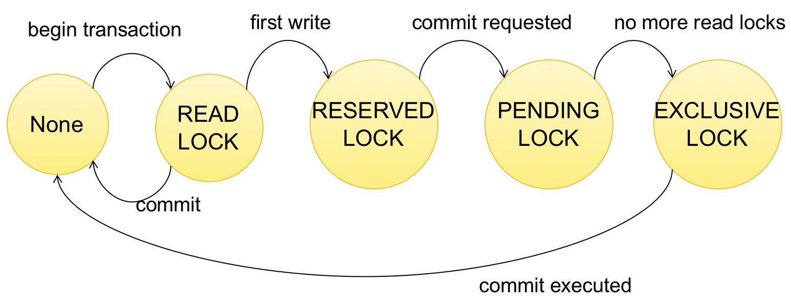

# CSE 344 Final Review

* Databases

    * Database: Collection of files storing <b>related data</b>.
    * Database Management System: an application program that allows us to nmanage efficiently the collection of data files.
    * Responsibility of DBMS:
        * Data storage and manipulation
        * Black box throught
        * Physical data independence

* Relational Databases

    * Motivation: avoid singular/flat files
    * Data Model: <b>Mathematical/Conceptual</b> way for decribling the data
        * Schemas and keys
        * Record and attributes
        * Attribute types/typing
    
        Three elements of data models:
        * Instance (actual data)
        * Schema (what data being stored)
        * Query language (how to retrieve qnd manipulate data)
    
    * Keys: one (or more) attributes that <b>uniquely identify</b> a record
        * When multiple keys, we can choose one key as <b>primary key</b>.
    * Foreign keys: attributes whose value is a key of a record in some other relation.

    * SQL Structure:
        * Flat tables:
            * First normal form
            * Crosswalks and joins
            * Breaking up data into multiple relations

            Tables are <b>not ordered</b>, <b>flat</b>, and has <b>physical data independence</b> (do not prescribe how they are implemented/stored on disk).
        
        * Code:
            * <code>create</code> statements: declaring <b>types</b> and <b>keys</b>.
            * <code>insert</code>/<code>delete</code> statements
            * <code>update</code>
            * <code>drop</code> table

        * <code><b>DISTINCT</b></code>: return unique elements 
            <b>Projection</b>: function which selects a subset of the attributes
        
        * Inner vs. Outer Joining
            * <b>inner joining</b>: each row must come from both tables
            * <b>outer joining</b>: include rows from only one of the two tables
            * <code>tableA (left/right/full) outer join tableB</code>:
                *  Left outer join: includes tuples from <code>tableA</code> even if no match
                *  Right outer join: includes tuples from <code>tableB</code> even if no match
                *  Full outer join: includes tuples from both <code>tableA</code> and <code>tableB</code> even if no match
        
        * Nested loop semantics
            * Cross-join multiple tables with selection

        * Self joins
            * includes one table multiple times
        
        * Aggregation:
            * Everything in <code>SELECT</code> must be either a <b>GROUP-BY</b> attribute, ot an aggregate.
        
        * <code>WHERE</code> vs. <code>HAVING</code>:
            * <code>WHERE</code> can contain any condition on attributes in <code>FROM</code> clause.
                * Applied to individual rows.
                * No aggregate.
            * <code>HAVING</code> can contain any condition on aggregate expressions and any group-by keys.
                * Entire group is returned, or removed.

        * Executing in order of: <b>FWGHOS</b>

        * Subqueries:
            * In <code>SELECT</code>: single attribute projection
            * In <code>FROM</code>: use <code>AS</code> and <code>WITH AS</code>
            * In <code>WHERE</code>: use <b>existential quantifiers</b> (<code>EXISTS</code>, <code>IN</code>, <code>ANY</code>, <code>ALL</code>)
            * <b>Correlated</b> subquery: depends on outside query.
            * Finding Witness (the product with max price): compute aggregate in subquery.
        
        * Monotonicity:
            * A query is <b>monotone</b> if whenever we add tuples to one or more input tables, the answer to the query will not lose any of the tuples.
            * If Q is a <code>SELECT-FROM-WHERE</code> query that <b>does not</b> involve any subqueries, Q <b>is</b> monotone.
            * Queries with <b>universal quantifiers</b>(all) or <b>negation</b> must be nested.
    
    * Relational Algebra:
        * Set/Bag semantics: differs on allowing/disallowing duplicates in tuples, also referred as "Standard"/"Extended" Relational Algebra

        * Operators:
            * Union $\cup$, intersection $\cap$, difference $-$
            * selection $\sigma$
            * projection $\pi$
            * Cartesian product $\times$, join $\bowtie$
            * Rename $\rho$
            * Duplicate elimination $\delta$
            * Grouping and aggregation $\gamma$
            * sorting $\tau$

            All operators take 1 or more relations as input and return another relation.

            Join in R.A.:
            * <b>Theta-join</b>: $R \bowtie_{\theta} S = \sigma_{\theta} (R \times S)$
            * <b>Equijoin</b>: Theta-joins which join condition $\theta$ only involves equilities.
            * <b>Natural Join</b>: $R \bowtie S = \pi_A(\sigma_\theta(R \times S))$

        * Relational Algebra is <b>equally expressive</b> with SQL.
    
    * Datalog:
        * For Queries that cannot be defined in RA (recursive queries)
        * Terminology:
            * Facts: tuples in database
            * Rules: queries
            * Extensional Predicates: predicates defined in database itself
            * Intensional Predicates: self-defined predicates
            * Head: the intensional predicates to be defined
            * Body: rule for each head (made with atoms/relational predicates)
            * head variables / existential variables
        * Fixpoint semantics: start with empty relations, repeat until $IDB_t = IDB_{t + 1}$.
            * A datalog program without functions (+, *, ...) always terminates in polynomial time.
        * Minimal model semantics: returns the smallest IDB such that all vars in EDB satisfies rule defined for this IDB (recursively too).
        * Linear:
            * Right-linear: <code>T(x, y) :- R(x, z), T(z, y)</code>
            * Left-linear: <code>T(x, y) :- T(x, z), R(z, y)</code>
            * Non-linear: <code>T(x, y) :- T(x, z), T(z, y)</code>
        * Writing Rules:
            * Safe: if every variable appears in some positive relational atom

* Semi-structured Data

    * <b>Transactional Data</b>: Frequent read, simple update 
    <b>Analytical Data</b>: Decision support, multiple joins & group bys

        OLTP (online transaction processing): simple look-up, many updates, consistency. 
        OLAP (online analytical processing): Decision Support
    * <b>Partitioning</b>: Store data partitioned on multiple servers, easy to write, hard to read (Good for transactional) 
    <b>Dupplication</b>: Duplicate data on multiple files, hard to write, easy to read (Good for analytical)
    * <b>JSON</b>: semi-stuctured data model
        * <code>{}</code> holds objects, <code>[a,b,...,x]</code> is an array.
        * Duplicate keys are allowed by standard, but not by mant implementations.
        * Allows <u>null values</u>, <u>duplicate attributes</u>, and <u>nested collections.</u>
    * <b>SQL++</b>:
        * Dataverse: is a database
            * <code>USE</code> + dataverse name
        * Type: defines a schema of a collection
            * Lists all required fields, <code>?</code> for optional fields.
            * <code>OPEN</code> permits other field, while <code>CLOSED</code> doesn't.
            * <code>PRIMART KET mykey AUTOGENERATED</code> to autogenerate a unique id for each entry.
    * indices:
        * Three type of indices available:
            * <code>BTREE</code>: for quality and range queries.
            * <code>RTREE</code>: for two-dimensional range queries: 
                for example: `WHERE x > 20 AND x < 30 AND y > 20 AND y < 30`
            * <code>KEYWORD</code>: for substring search.
        * <b>CANNOT</b> index inside a nested collection.
        * Syntax: `CREATE INDEX countryID ON country(carCode) TYPE BTREE`
    * <b>Heterogeneous collections</b>: Same attribute, but in some object is array, in some object is not.
        * Solution: Use `(CASE ... WHEN...THEN...ELSE...) u`, and `is_array()` helper function.
    * <code>UNNEST</code>: distribute each element in this array to the rest of the row.
    * Multi-value join: split an array to "unnest" with <code>split(y.'country', " ")</code>.

* Physical Plan:

    * Overall execution of a SQL query: 
    Parse SQL -> Select logical plan (Relational ALgebra) -> Select physical Plan -> execute. 
    Physical Plans: Choose an effective implementation for a RA operator.

    * Basic Physical Operator: Join
        * Nested Loop Join: $O(n^2)$
        * Merge Join: $O(n log(n))$
        * Hash Join: $O(n)$ to $O(n^2)$
    
    * Physical Data Independence: Apps are insulated from how data is stored physically.

    * Data Storage:
        * DBMS store data in files, each file is splitted into blocks, and each block contains serveral tuples.
        * Data file can be either a <u>Heap file</u> (unsorted), or <u>Sequencial file</u> (sorted according to some attribute/key).
        * Index: Additional file mapps from a search key (some attribute's value) to the actual tuple in memory. (<i>Could have many index for one table.</i>)
            * Clustered index: records close in index is close in data
            * Unclustered index: records close in index may be far in data
            * Primary: Over attributes including primary key
            * Secondart: Otherwise.

    * Scanning a disk: Sequencial scan is much faster than random accessing the disk.

    * Index should be selected on attributes which:
        * an exact match
        * a range match (clustered index works the best)
        * a join
    
        On such key is needed. (solution to <b>index selection problem</b>).
    
    * Cost Estimation:
    
        * Parameters for cost estimation: for some relation R,
            * B(R): number of blocks in R
            * T(R): number of tuples in R
            * V(R, a): number of distinct values of attribute a
                * Note that when a is a key, V(R, a) = T(R); else, V(R, a) $\leq$ T(R)
        
        * Cost of:
            * Sequentially scan a table: B(R)
            * Index-based scanning:
                * Clustered: f * B(R)
                * Unclustered: f * T(R) 
                [Note: f is usually 1/V(R, a), which a is the key that index is built on]
        
        * Join Cost:
            * <b>Hash Join</b>: Scan one table into memory and build hash table, scan in the other table and join.
                * Overall cost: B(R) + B(S)
                * Should build hashTable on the relation with more distinct attributes.
            * <b>Nested Loop Join</b>: Scan one table into memory, scan in the other and compare each tuple pair to determine if successfully joins.
                * Overall cost: B(R) + T(R) * B(S)
            * <b>Sort-merge Join</b>: Scan two tables and sort in memory, then merge-join them. (Not one-pass algorithm)
                * Overall cost: B(R) + B(S)
            * <b>Index Nested loop Join</b>: Assume S has an index page in memory. So iterate over R and fetch corresponding entries of S.
                * Cost if S is clustered: B(R) + T(R) * (B(S) / V(S, a))
                * Cost if S is unclustered: B(R) + T(R) * (T(S) / V(S, a))

* Parallel/Map-Reduce:

    * Speed up: More nodes(processors, computers), same data, more speed 
      Scale up: More nodes, more data, same speed 
    
    * Shared-nothing: each machine has its own disk and memory. Easy to maintain and scale, but hard to administer and tune.

    * Intra-operator parallelism:
        * Each operator is placed on multiple nodes.
        * Good for both transactional and analytical work.
    
    * Horizontal Data Partinioning:
        * Block Partition: partition arbitarily with block alignment.
        * Hash Partition on some attribute
        * Range Partition: a tuple goes to some server if value falls in some range.
    
    * Uniform Data/Skewed Data:
        * Uniform Data: Data is partitioned uniformly across servers.
            * Block Partition will be unform.
        * Skewed Data: Some server holds more data than other servers.
            * Hash Partition/Range Partition on some attribute may cause this problem.
    
    * Shuffle & Broadcast:
        * Shuffle Join: Reshuffle each table on the common attribute, and compute join locally.
        * Broadcast join: Reshuffle one table on the common attribute, join with another table, and broadcast the result.
    
    * Map/Reduce framework:
        * Map: extract something you care about for each record.
        * Reduce: aggregate, summerize, filter, transform
        * Fault-tolerance: map writes to local disk, reduce reads from disk. If fails, the reduce task is restarted on another server, but slow.
        * Spark uses "Resilient distributed datasets" = main memory + linerage.
    
    * Straggler: a machine takes unusual long to complete one of the last tasks.
        * Solution: pre-emptive back up execution of last few in-progress tasks.

* Database design:

    * Conceptual model for database design:
        * Entity: an object
            * Attribute: attributes of entity. Each entity set must have a key, which can be one attribute or serveral attributes.
        * Relationship: how entities are related.
        * Weak entities: entities which key come from other classes which they are related
    
    * Relationship between entities:
        * <b>One to one</b>: No seperate table
        * <b>One to many</b>: No seperate table
        * <b>Many to many</b>: Seperate table
    
    * Integrity constraint motivation: a consition specified on a database schema which restricts the data that can be stored on any instance of the database.
        * Key Constraints: the key in each schema must uniquely identifies a person
        * single-value constraints: a person can only have one biological father
        * Referetial integrity constraints: if you work for a company, it must exist in the database.
        * Other constraints: value needs to be in legal range.
    
    * Constrains in `SQL`:
        * Primary Key, Foreign Key
            * `UNIQUE(name)` can be used to ensure `name` is unique (even if it is not primary key). There can be many unique.
            * Foreign key constraints: the referential integrity cnostraints. The referred column must be a key in another table.
        * Attribute level constraints
            * `NOT NULL`
            *  `CHECK` can check any condition
        * Tuple-level constraints
        * Global constraints/Assertions
    
    * Functional Dependencies: if one attribute implies another 
        Closure: everything that an attribute determine
        * If $A \rightarrow B$ and $B \rightarrow C$, then $A \rightarrow {B, C}$.
        * Formal notation: $\{A\}^+ = \{A, B, C\}$
        * If one attribute determines all other attributes in the schema, then it is called <b>superkey</b>
        * The smallest subset of attributes that does it is called the <b>minimal key</b> or just <b>key</b>.
    
        Boyce-Codd Normal Form (BCNF): No bad functional dependencies.
        * For all attribute $X$, either $\{X\}^+ = \{X\}$ or $\{X\}^+ =$ all attributes.
        * Whenever $X \rightarrow B$ is a non-trival dependency, then $X$ is a superkey.

* Transactions:

    * Changes to database should be all or nothing.
    * Transaction: Collection of statements that are executed atomically (logically speaking)
    * Transaction Properties:
        * <b>A</b>tomic: State shows either all effect for a transaction, or none of them.
        * <b>C</b>onsistent: Integrity must hold before and after transaction is executed.
        * <b>I</b>solated: effect of each transaction is as if it were the only
transaction running on the system
        * <b>D</b>urable: transaction's effect remains after execution finishes.
    * <b>Serial Schedule</b>: transactions are executed sequentially
    * <b>Serializable Schedule</b>: equivalent to a serial schedule
        * Determine if schedule is serializable by looking at conflicts (swapping will change program behavior)
            * READ-WRITE
            * WRITE-READ
            * WRITE-WRITE
    * <b>Conflict Serializable Schedule</b>: transform into a serial schedule by swapping adjacent non-conflicting actions. (Every conflict serializable schedule is a serializable schedule).
        * Testing Conflict Serializable Schedule with <b>Precedence Graph</b>: each vertex is a transaction; an edge from A to B if an action in A conflicts with action in B and comes before B.
        * The schedule is conflict serializable if and only if the graph is <b>acyclic</b>.
    * Recoverable: Each transaction commits after all transactions from which it has read has committed.
    * <b>Scheduler</b> (Concurrency Control Manager): the module which schedules transactions, ensuring serializability.
        * Locking Scheduler: each element acquires the lock, wait until other transactions release the lock, then use. Picture below is the locking scheduler for SQLite.
        
    * If no concurrency control:
        * Dirty Read (including inconsistent read)
        * Unrepeatable reads
        * Lost updates
    * Two-phase locking: In every transaction, all lock requests must precede all unlock requests. (Ensures Conflict serializability)
    * Strict 2PL:
        * All locks are held until commit/abort:
        * All unlocks are done together with commit/abort.

        With strict 2PL, we can get schedules both conflict-serializable and recoverable.
    * DEADLOCK: Locks waiting for other locks to release and stuck in infinite loop. 
    Solution: Use graph to check for cycles and if detected, abort one transaction.
    
    * Isolation Levels in SQL:
        * `READ UNCOMMITTED`
            * Strict 2PL for WRITE locks, no READ locks.
        * `READ COMMITTED`
            * Strict 2PL for WRITE locks, only acquire locks for READ locks (not 2PL)
        * `REPEATABLE READ`
            * Strict 2PL for both READ and WRITE
        * `SERIALIZABLE`
            * Strict 2PL for both READ and WRITE, and <b>Predicate locking</b> to deal with phantoms.
                * Phantom: a tuple that is invisible during part of a transaction execution but not invisible during the entire execution
                * Predicate lock: a lock on an arbitary predicate.